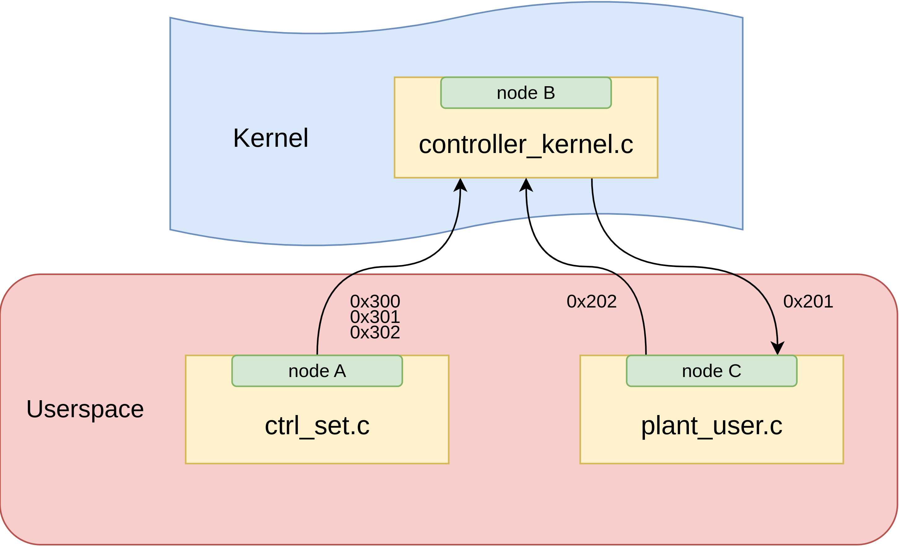

# CAN PID Thermal Plant Simulation

This project simulate the closed thermal loop on top of SocketCAN. It lets you experiment with a dual-loop PID controller that lives in the Linux kernel, a user-space plant model, and a helper tool that sets controller targets. Everything is tuned so you can run the whole system on a single machine using the virtual `vcan` bus.

<p align="center">
  
</p>

- **Node A (`ctrl_set`)** pushes a temperature set-point and optional gain overrides on CAN IDs `0x301`, `0x300`, and `0x302`.
- **Node B (`controller_kernel`)** ingests those frames plus the plant feedback (`0x202`), runs the controller in kernel space, and transmits pump/fan commands on `0x201`.
- **Node C (`plant_user`)** is a fairly detailed thermal/fluid model that reacts to `0x201`, integrates the plant, and publishes telemetry on `0x202`.

Unit tests cover the user-space helpers via GoogleTest, while KUnit covers the kernel module logic. Convenience scripts wire everything together.

---

## Prerequisites

- Linux with SocketCAN support (`vcan`, `iproute2`, `modprobe`) and kernel headers installed.
- GCC/Clang toolchain for user-space builds.
- CMake ≥ 3.15 and GoogleTest development packages for unit tests.
- A buildable kernel tree if you plan to run KUnit under UML (handled automatically by `test_kernel_driver.sh`).

> The helper scripts call `sudo` for `modprobe`, `ip link`, and `insmod`. Ensure your user can run those commands.

---

## Quick Start (all three nodes)

```bash
chmod +x run.sh
./run.sh
```

What the script does:

1. Creates `vcan0` (idempotent).
2. Builds the out-of-tree kernel module in `controller/`.
3. Loads `controller_kernel.ko` with `ifname=vcan0 period_ms=100 idle_ms=1500`.
4. Builds `plant_user` and `ctrl_set`.
5. Opens three terminals: plant simulation, controller parameter UI, and a kernel log tail (`journalctl -k -f`).

The controller terminal pauses so you can adjust the set-point (°C) and gains before sending them to Node B.

---

## Manual Builds & Usage

### Plant simulator (`plant_user`)

```bash
gcc -O2 -Wall -o plant_user plant_user.c -lm
./plant_user vcan0 --Ts 60 --Th 40 --Tc 20 --v_prev 1200 --dt_ms 15 --mdot 0.25
```

Receives `0x201` pump/fan commands, integrates the plant, and emits `0x202` with:

| Byte | Signal                 | Notes                          |
|------|------------------------|--------------------------------|
| 0-1  | `Ts` (q0.1 °C)         | System temp                    |
| 2-3  | `Th` (q0.1 °C)         | Hot leg temp                   |
| 4-5  | `Tc` (q0.1 °C)         | Cold leg temp                  |
| 6    | `v_prev` (rpm / 10)    | Last applied fan command       |
| 7    | `dt_ms`                | Integration step (1–255 ms)    |

The underlying model enforces physical clamps (temperatures, flow, fan speed) and exposes helpers such as `sat`, `softabs`, `mu_water`, and `plant_step` for testing.

### Controller parameter tool (`ctrl_set`)

```bash
gcc -O2 -Wall -o ctrl_set ctrl_set.c -lm
./ctrl_set vcan0 30.0 --kp 120 --ki 0.15 --kd 5 --kaw 4 \
                          --kpm 150 --kim 0.02 --kawm 8 --kvw -0.1 --kwv -0.03
```

- `0x301`: set-point (°C → q0.1 °C).
- `0x300`: temperature loop PID gains (q8.8) + anti-windup (`kawT`, q4.4).
- `0x302`: flow loop gains (q8.8) + mixed/decoupling terms (q4.4).
- Add `--no-params` to send only the set-point.

Default gains match the kernel module’s built-in constants; overrides are clamped to prevent overflow when quantized.

### Kernel controller (`controller/controller_kernel.c`)

Build/load manually if you prefer:

```bash
cd controller
make                                  # builds controller_kernel.ko (and KUnit test module if CONFIG_KUNIT)
sudo insmod controller_kernel.ko ifname=vcan0 period_ms=100 idle_ms=1500
# ...
sudo rmmod controller_kernel
```

- Registers CAN filters for `0x301`, `0x300`, `0x302`, and `0x202`.
- Uses a high-resolution timer to transmit `0x201` periodically, but only after plant telemetry has arrived (idle guard).
- Control core runs entirely in fixed-point (`q16.16`) and applies integrator anti-windup, derivative filtering, and actuator clamps (`omega_max=4000 rpm`, `v_max=2800 rpm`).

Kernel logs are tagged with `[B]` for easy filtering.

---

## Controller Node Overview

- **High-resolution timers:** Uses an `hrtimer` (`tx_timer`) to schedule CAN ID `0x201` transmissions at `period_ms`, giving sub-millisecond jitter compared to `timer_list`.
- **Inactivity watchdog:** A second `hrtimer` (`rx_guard`) counts down `idle_ms`; if plant feedback (`0x202`) goes silent the guard cancels command TX to prevent runaway actuation.
- **CAN ingress:** Registers filters for `0x300/0x301/0x302/0x202`, storing frames in a lock-protected FIFO processed by a workqueue bottom-half.
- **State machine:** `have_feedback` and `state` variables gate the timers—new telemetry arms `tx_timer`, guard expirations disarm it, and module unload stops both paths cleanly.
- **Control loop:** On each timer fire, telemetry is converted to Q16.16, PID + decoupling terms compute `omega_cmd_rpm` and `v_cmd_rpm`, results are clamped, and the CAN frame is emitted through the raw socket.
- **Runtime tuning:** Frames from `ctrl_set` update controller gains immediately, so PID tuning happens without recompiling or reloading the module.

---

## Plant Node Overview

- **SocketCAN polling:** Opens a raw CAN socket on `vcan0`, filters for `0x201`, and uses `poll()` with a 50 ms timeout to interleave computation and CAN RX without busy waits.
- **Deterministic timestep:** Tracks a fixed integration step (`dt_ms`) from CLI or quantized feedback; enforces 0.5–255 ms bounds so packing into a single byte stays valid.
- **Thermal-fluid model:** Maintains `Plant` state (`Ts`, `Th`, `Tc`, `mdot`, `v_prev`) and integrates via `plant_step`, combining pump torque, radiator UA, and system heating with saturation guards.
- **Safety clamps:** Wraps helpers like `sat`, `safe_sq`, and `pack_*` to keep temperatures, flow, and fan speeds within physical limits before transmission.
- **Telemetry emission:** Packages the evolved state into CAN ID `0x202`, using q0.1 for temperatures and q10 for fan speed, and transmits every iteration through the same socket.
- **Diagnostics:** Periodically prints plant state and last command, aiding controller tuning without needing an external CAN monitor.

---

## Testing

- **User-space unit tests** (GTest + CTest):

  ```bash
  chmod +x test_userspace_driver.sh
  ./test_userspace_driver.sh
  ```

  Builds the project in `build/`, runs `plant_user` and `ctrl_set` tests, then drops into the kernel directory to build and run the KUnit module on the host kernel (requires CONFIG_KUNIT).

- **KUnit under UML** (no host kernel rebuild):

  ```bash
  chmod +x test_kernel_driver.sh
  ./test_kernel_driver.sh          # clones a Linux tree on demand and runs the suite
  ./test_kernel_driver.sh --clean  # remove the temporary kernel checkout
  ```

  Stages the driver into `drivers/misc/nodeb`, writes a `.kunitconfig`, and invokes `tools/testing/kunit/kunit.py run`.

---

## Repository Layout

| Path                                         | Purpose |
|----------------------------------------------|---------|
| `ctrl_set.c`, `ctrl_set_api.h`               | Node A user-space tool + public test header |
| `plant_user.c`, `plant_user_api.h`           | Node C simulator + public test header |
| `controller/`                                | Out-of-tree kernel module + KUnit tests |
| `unit_test/`                                 | CMake-based GoogleTest suites |
| `run.sh`, `test.sh`, `test_kernel_driver.sh`      | Convenience scripts (run full stack, run tests, run UML KUnit) |
| `CMakeLists.txt`, `unit_test/**/CMakeLists`  | Build configuration for unit tests |

Build artifacts (`plant_user`, `ctrl_set`, kernel `.ko`, CMake `build/`) are kept at the top level by the helper scripts.

---

## Tips & Troubleshooting

- `x-terminal-emulator` must exist for `run.sh`; adjust the script if you prefer another terminal.
- If `CONFIG_KUNIT` is disabled in your running kernel, the `controller/Makefile` skips building `tests/nodeb_kunit_test.o`. In that case rely on `test_kernel_driver.sh`.
- Reset the `vcan0` interface manually with `sudo ip link delete vcan0` if you need a clean slate.
- Use `journalctl -k -f` or `dmesg --follow` to watch controller logs while experimenting with gain changes.

Enjoy exploring the controller/plant interaction without needing hardware!
